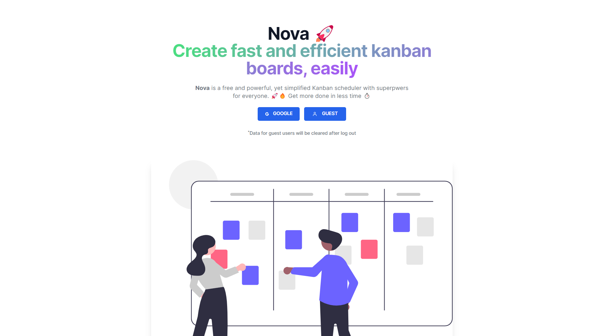

# Nova 🚀
Create fast and efficient kanban boards, easily ✅❤️🔥

## Features

- **Plain text/markdown notes** - take notes in an efficient way
- **Markdown preview** - preview Markdown before saving
- **Drag and drop** - drag and drop a column or a board
- **Persistence** - all user data is stored in Firebase database


## About


Nova🚀 is a kanban board for productivity. It is a web based kanban planner with superpowers. Want to get some todos listed? We got you! What about some sorting of work? We got you there too!
Our drag and drop feature allows you to move items anywhere you like, making them your own 👍
Make use of our markdown editor too, it's pretty useful. Oh and, it also has a preview for markdown files built-in. 🤯

#### Why  I built this:

- I wanted something fancy for my portfolio 🤩
- I wanted to try out drag-n-drop libraries out there in the wild. I used `react-beautiful-dnd`
- I wanted something that I could rely on to save simple notes while working in the browser
- I wanted to know more firebase
- I was curious about how people made it, so I decided to use the same resources to make mine

I'm leaving the code available so you can feel free to host your own Nova🚀 instance or study the code for learning purposes. If you got any questions, just hit me up:

- Twitter [@hunchodotdev](https://twitter.com/hunchodotdev)
- Discord username [FatKidOnFiree#1355](FatKidOnFiree#1355) Add me as a friend ❤️
- Email [hunchodotdev@gmail.com](mailto:hunchodotdev@gmail.com)
- Email again [wartywarthog7@gmail.com](wartywarthog7@gmail.com)
- Telegram [FatKidOnFiree](https://t.me/FatKidOnFiree)
- Reddit username [yrn_quavo](yrn_quavo)

Nova was created with [React](https://reactjs.org) and [Firebase](https://firebase.google.com).


A screenshot of all the columns you create with their boards


## Reviews

> _"This app is truly fire, like no cap 😂"_ — Likem

> _"Nice one, champ 🤝"_ — Kenneth

> _"Awesome work bro 🔥"_ — @devkobie 


## Installation and development

This app runs by default on port `3000`. 


```bash
git clone git@github.com:lucky-chap/nova
cd nova
npm i
```

#### After doing the above:
##### **These steps are intended for complete beginners in using Firebase
- Log in to your firebase [console](https://console.firebase.google.com)
- Create a new project
- Enter the details of the project. Disable `Google Analytics for this project` 
- After the project is created, click on the web app icon ( `</>` ) to add an app
- Register the nickname of the app. Make sure not to enable `Also set upFirebase Hosting for this app`
- After the app is generated, the second step is to add the firebase SDK
- Copy the generated firebase SDK code
- Specifically copy the contents of the `firebaseConfig` object
- Now go into [.env.example](./.env.example)
- In the `firebaseConfig` object, replace the values of every key accordingly
- For example `REACT_APP_FIREBASE_API_KEY= 'the value of the firebaseConfig.apiKey'`
- Do the same for the rest

#### Afte doing the above:
Run the following command

```bash
npm start
```

Open your browser to [localhost:3000](http://localhost:3000) to see the app running live 👍

Demo screenshot when editing a board


## Contributing

⚠️ As of now, I have not provided a guide on contribution yet, but I'm working on that


## Acknowledgements

A big thank you to all the repos I used for referencing, and even used their style of coding. Here are a few of the ones I remember.


- [Jira Clone](https://github.com/oldboyxx/jira_clone?ref=bestofreactjs.com) (I used this the most)
- [Personal Kanban](https://github.com/nishantpainter/personal-kanban)
- [React Kanban](https://github.com/asseinfo/react-kanban)
- [Firebase Kanban](https://github.com/FixterGeek/firebase-dnd-kanban)
- [Yirichie's Kanban Board](https://github.com/yirichie/kanban-board)

## Author

- [Quavo](https://www.github.com/lucky-chap)

## License

This project is open source and available under the [MIT License](./LICENSE.txt).
